---
## Front matter
lang: ru-RU
title:  Управление версиями
author: |
	 Шах Дхирадж НПИБД-02-20\inst{1}

institute: |
	\inst{1}Российский Университет Дружбы Народов

date: 18 ноября, 2021, Москва, Россия

## Formatting
mainfont: PT Serif
romanfont: PT Serif
sansfont: PT Sans
monofont: PT Mono
toc: false
slide_level: 2
theme: metropolis
header-includes: 
 - \metroset{progressbar=frametitle,sectionpage=progressbar,numbering=fraction}
 - '\makeatletter'
 - '\beamer@ignorenonframefalse'
 - '\makeatother'
aspectratio: 43
section-titles: true

---

# Цели и задачи работы

## Цель лабораторной работы

Целью данной работы является изучение идеологии и применения средств контроля версий.

## Задачи лабораторной работы

1. Создать учетную запись на github.com

2. Настроить репозиторий и организовать доступ по ssh

3. Изучить механизм управления версиями

# Процесс выполнения лабораторной работы

## Создаем учетную запись на github.com и репозиторий

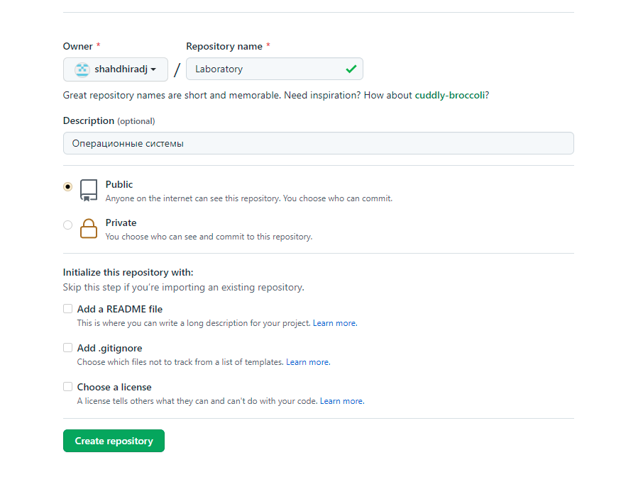{ #fig:001 width=70% }

## Инициализируем локальный репозиторий

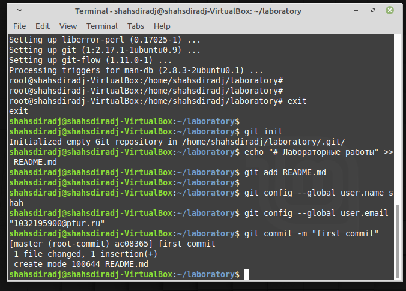{ #fig:002 width=70% }

## Создаем SSH-ключ

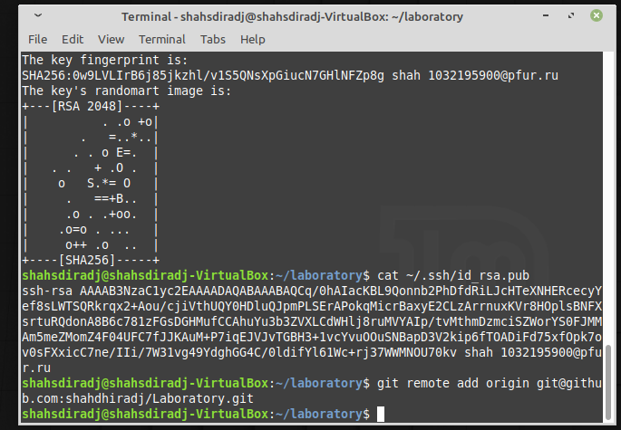{ #fig:003 width=70% }

## Создаем SSH-ключ

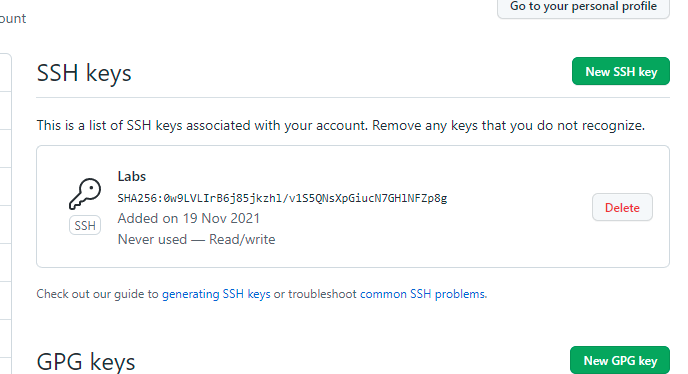{ #fig:004 width=70% }

## Загружаем служебные файлы

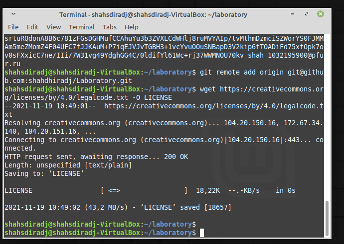{ #fig:005 width=70% }

## Загружаем служебные файлы

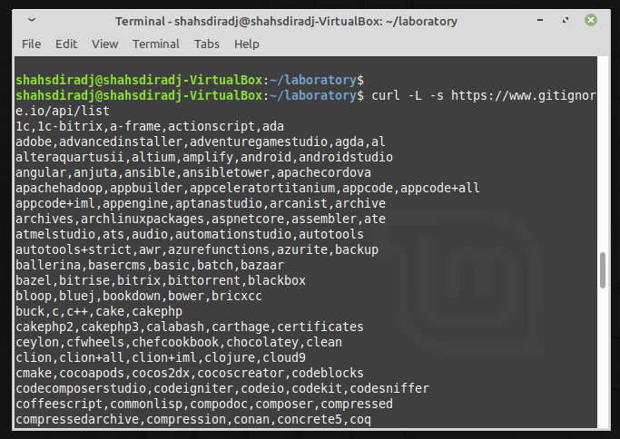{ #fig:006 width=70% }

## Отправляем файлы в репозиторий

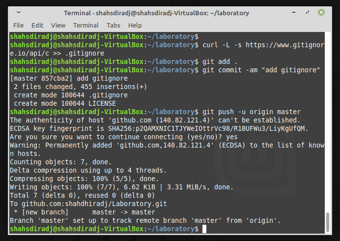{ #fig:007 width=70% }

## Использование системы управления версиями

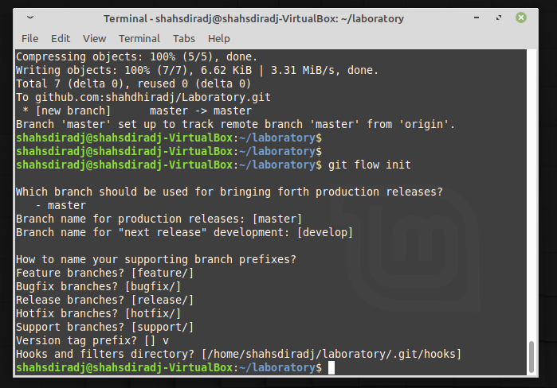{ #fig:008 width=70% }

## Использование системы управления версиями

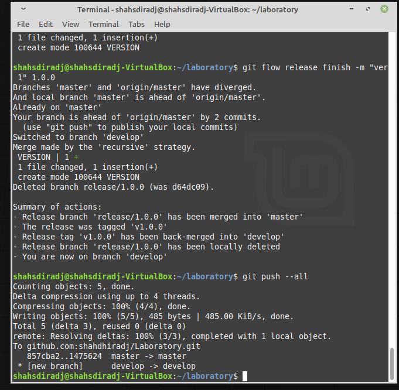{ #fig:010 width=70% }

## Использование системы управления версиями

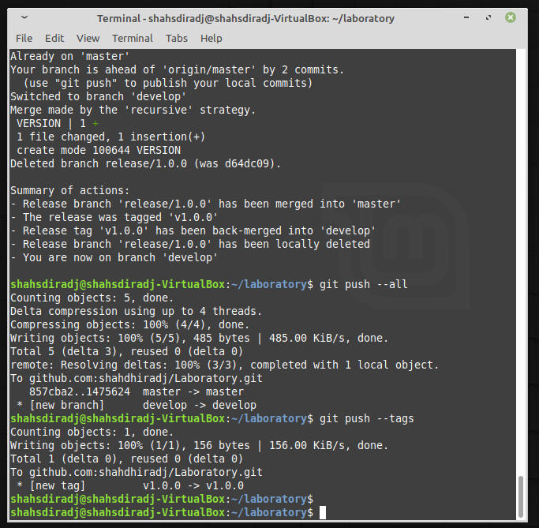{ #fig:011 width=70% }

## Выполним объединение веток

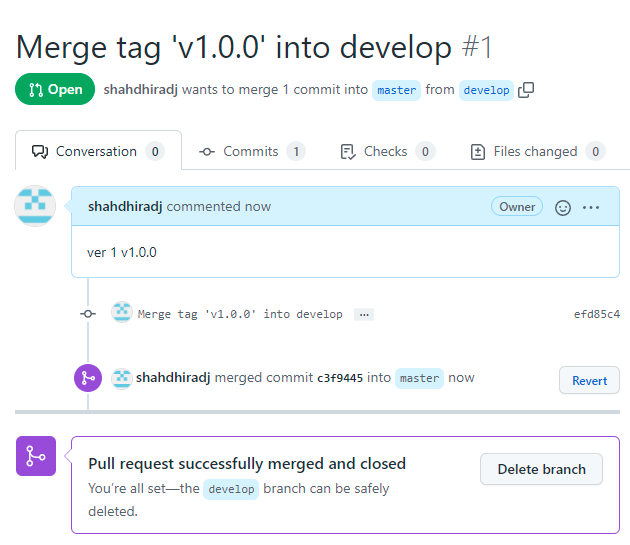{ #fig:012 width=70% }

# Выводы по проделанной работе

## Вывод

Мы приобрели практические навыки работы с системой контроля версий git и создали свой репозиторий