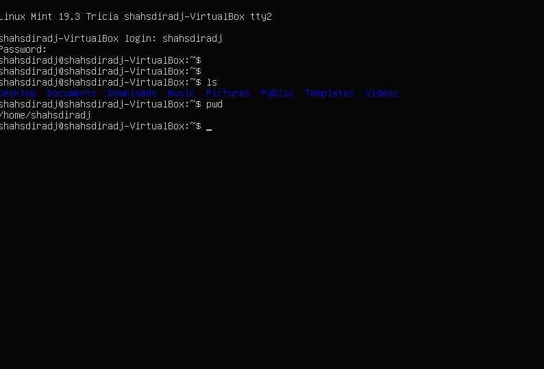
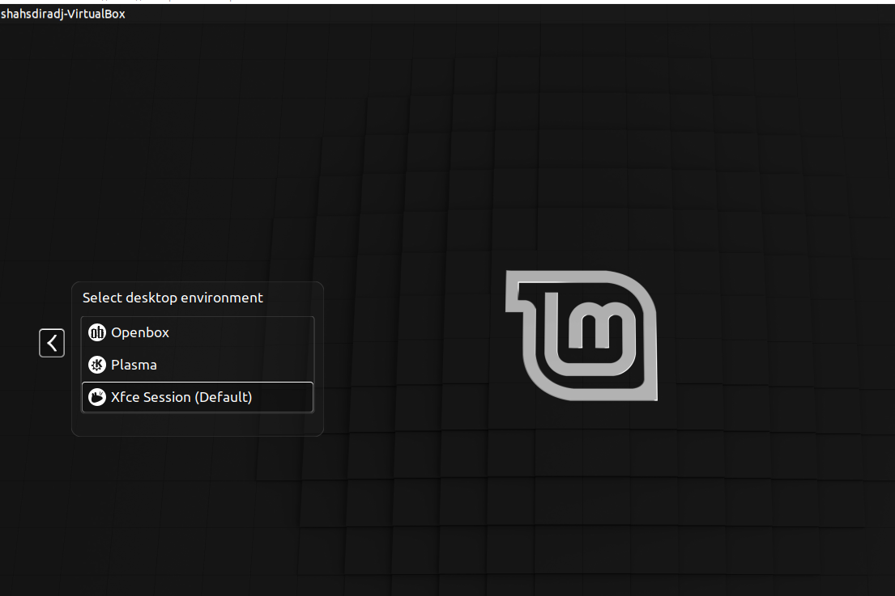
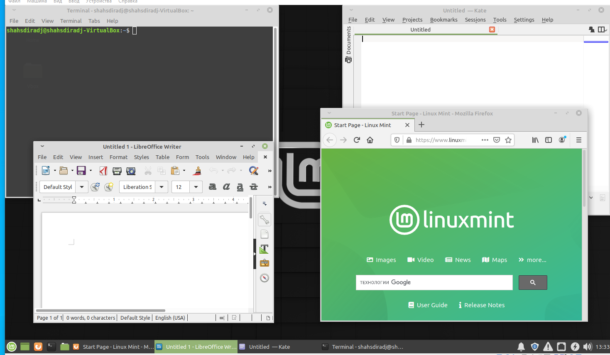
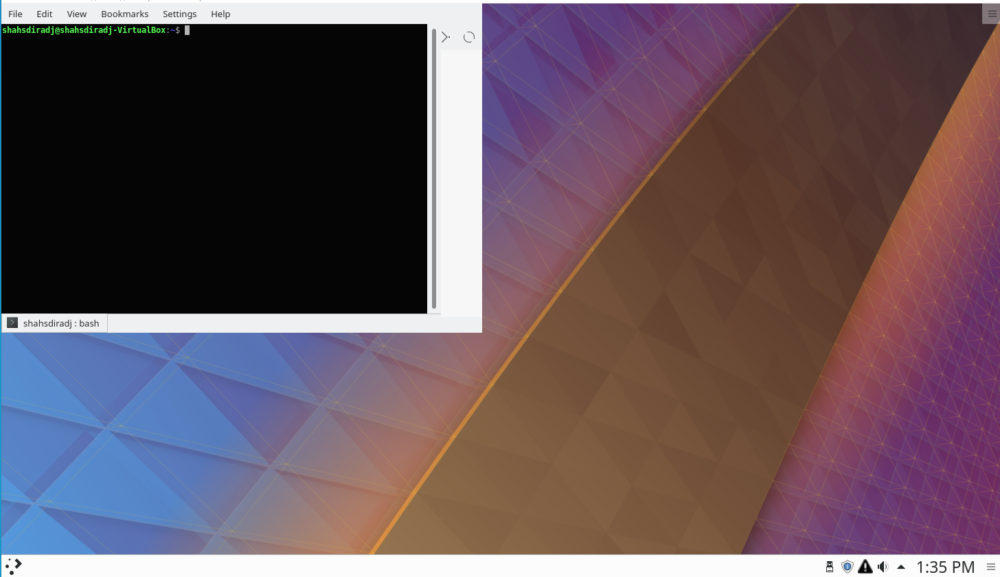
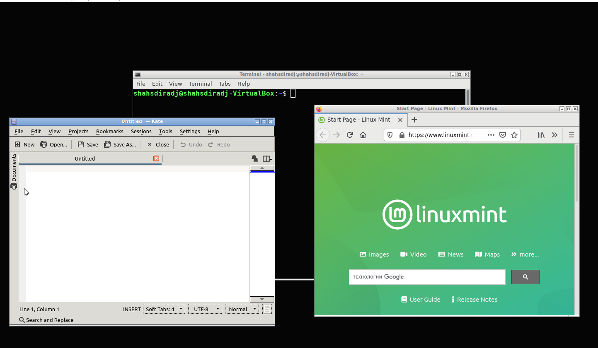

---
## Front matter
lang: ru-RU
title:  Знакомство с операционной системой Linux
author: |
	 Шах Дхирадж НПИБД-02-20\inst{1}

institute: |
	\inst{1}Российский Университет Дружбы Народов

date: 15 ноября,, 2021, Москва, Россия

## Formatting
mainfont: PT Serif
romanfont: PT Serif
sansfont: PT Sans
monofont: PT Mono
toc: false
slide_level: 2
theme: metropolis
header-includes: 
 - \metroset{progressbar=frametitle,sectionpage=progressbar,numbering=fraction}
 - '\makeatletter'
 - '\beamer@ignorenonframefalse'
 - '\makeatother'
aspectratio: 43
section-titles: true

---

# Цели и задачи работы

## Цель лабораторной работы

Познакомиться с операционной системой Linux, получить практические навыки работы с консолью и некоторыми графическими менеджерами рабочих столов операционной системы.

## Задачи лабораторной работы

1 Ознакомиться с теоретическим материалом.

2 Загрузить компьютер.

3 Перейти на текстовую консоль. Сколько текстовых консолей доступно на вашем
компьютере?

4 Перемещаться между текстовыми консолями. Какие комбинации клавиш необходимо при этом нажимать?

## Задачи лабораторной работы

5 Зарегистрироваться в текстовой консоли операционной системы. Какой логин вы при этом использовали? Какие символы отображаются при вводе пароля?

6 Завершить консольный сеанс. Какую команду или комбинацию клавиш необходимо для этого использовать?

7 Переключиться на графический интерфейс. Какую комбинацию клавиш для этого необходимо нажать?

8 Ознакомиться с менеджером рабочих столов. Как называется менеджер, запускаемый по умолчанию?

## Задачи лабораторной работы

9 Поочерёдно зарегистрироваться в разных графических менеджерах рабочих столов (GNOME, KDE, XFCE) и оконных менеджерах (Openbox). Продемонстрировать разницу между ними, сделав снимки экрана (скриншоты). Какие графические менеджеры установлены на вашем компьютере?

10 Изучить список установленных программ. Обратить внимание на предпочтительные программы для разных применений. Запустите поочерёдно браузер, текстовой редактор, текстовой процессор, эмулятор консоли. Укажите названия программ.

# Процесс выполнения лабораторной работы

## Работа с текстовой консолью

{ #fig:001 }

## Графические менеджеры

{ #fig:002 }

## Графические менеджеры

{ #fig:003 }

## Графические менеджеры

{ #fig:004 }

## Графические менеджеры

{ #fig:005 }

# Выводы по проделанной работе

## Вывод

Выполнив данную лабораторную работу, мы познакомились с операционной системой Linux, получили практические навыки работы с консолью и некоторыми графическими менеджерами рабочих столов операционной системы.