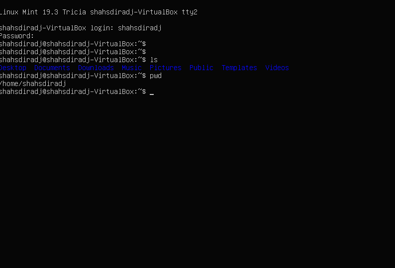
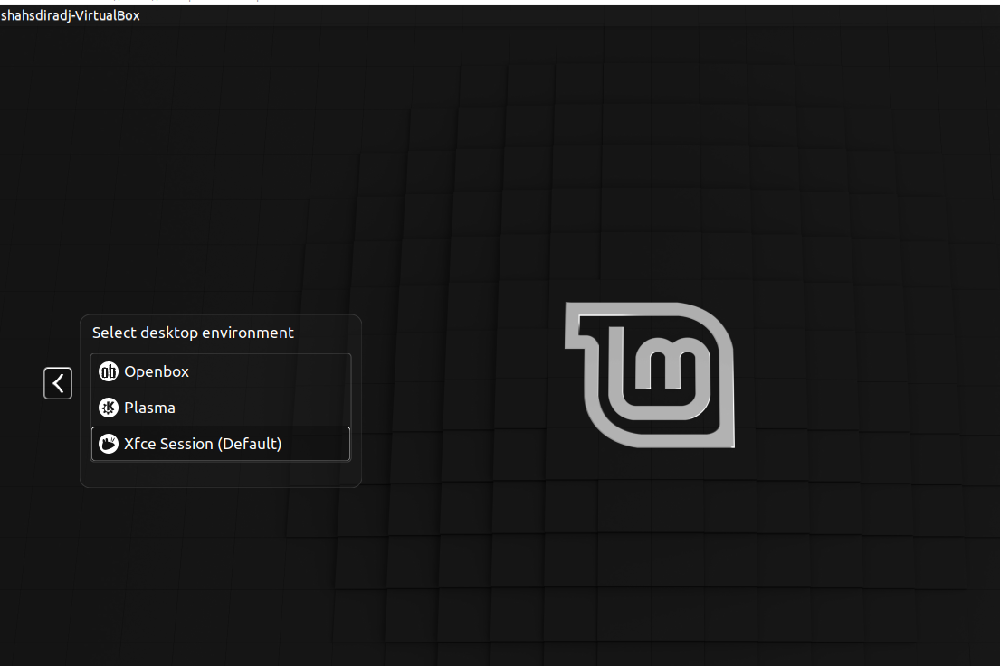
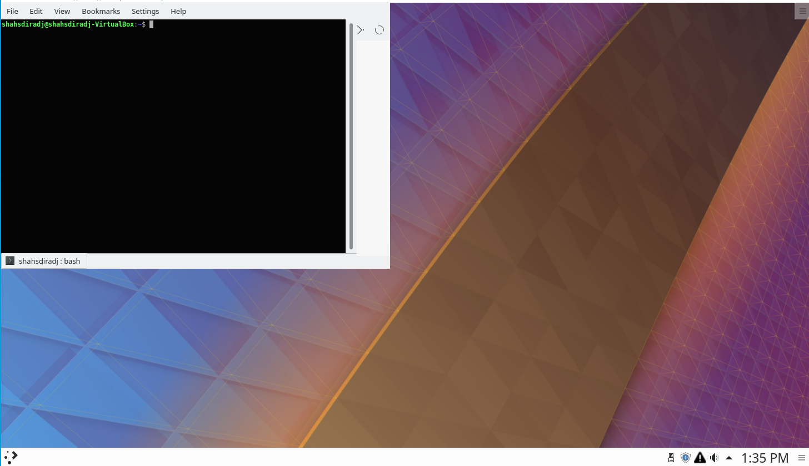
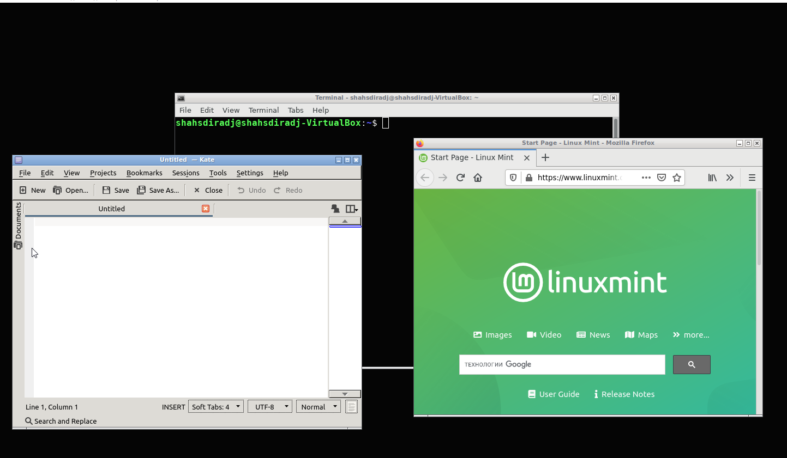

---
# Front matter
lang: ru-RU
title: "Отчёт по лабораторной работе №4"
subtitle: "Знакомство с операционной системой Linux"
author: "Шах Дхирадж НПИБД-02-20"

# Formatting
toc-title: "Содержание"
toc: true # Table of contents
toc_depth: 2
lof: true # List of figures
fontsize: 12pt
linestretch: 1.5
papersize: a4paper
documentclass: scrreprt
polyglossia-lang: russian
polyglossia-otherlangs: english
mainfont: PT Serif
romanfont: PT Serif
sansfont: PT Sans
monofont: PT Mono
mainfontoptions: Ligatures=TeX
romanfontoptions: Ligatures=TeX
sansfontoptions: Ligatures=TeX,Scale=MatchLowercase
monofontoptions: Scale=MatchLowercase
indent: true
pdf-engine: lualatex
header-includes:
  - \linepenalty=10 # the penalty added to the badness of each line within a paragraph (no associated penalty node) Increasing the value makes tex try to have fewer lines in the paragraph.
  - \interlinepenalty=0 # value of the penalty (node) added after each line of a paragraph.
  - \hyphenpenalty=50 # the penalty for line breaking at an automatically inserted hyphen
  - \exhyphenpenalty=50 # the penalty for line breaking at an explicit hyphen
  - \binoppenalty=700 # the penalty for breaking a line at a binary operator
  - \relpenalty=500 # the penalty for breaking a line at a relation
  - \clubpenalty=150 # extra penalty for breaking after first line of a paragraph
  - \widowpenalty=150 # extra penalty for breaking before last line of a paragraph
  - \displaywidowpenalty=50 # extra penalty for breaking before last line before a display math
  - \brokenpenalty=100 # extra penalty for page breaking after a hyphenated line
  - \predisplaypenalty=10000 # penalty for breaking before a display
  - \postdisplaypenalty=0 # penalty for breaking after a display
  - \floatingpenalty = 20000 # penalty for splitting an insertion (can only be split footnote in standard LaTeX)
  - \raggedbottom # or \flushbottom
  - \usepackage{float} # keep figures where there are in the text
  - \floatplacement{figure}{H} # keep figures where there are in the text
---

# Цель работы

Познакомиться с операционной системой Linux, получить практические навыки работы с консолью и некоторыми графическими менеджерами рабочих столов операционной системы.

# Выполнение лабораторной работы

1. Ознакомились с теоретическим материалом. 

2. Загрузили компьютер. 

3. Перешли на текстовую консоль, воспользовавшись сочетанием клавиш alt+ctrl+(F1-F6). На моем компьютере доступны шесть текстовых консолей.

4. Чтобы перемещаться по текстовой консоли необходимо воспользоваться сочетанием клавиш alt +(F1-F6).

5. Зарегистрировались в текстовой консоли операционной системы. Использовали логин пользователя. При вводе пароля символы не отображаются.

6. Чтобы завершить сеанс работы в виртуальной текстовой консоли, необходимо набрать команду: “logout” или воспользоваться сочетанием клавиш: ctrl+D.

{ #fig:001 width=70% }

7. Чтобы переключится на графический интерфейс, необходимо воспользоваться комбинацией клавиш: ctrl+alt+F7. Перехожу на графический интерфейс.

8. Менеджер рабочих столов, запускаемый по умолчанию, называется: “xfce”.

{ #fig:002 width=70% }

9. Поочерёдно регистрируюсь в разных графических менеджерах рабочих столов и оконных менеджерах. На компьютере установлены различные графические менеджеры:  XFCE, KDE, Openbox.

10. Изучили список установленных программ. Запустили поочерёдно браузер Mozilla Firefox, текстовой редактор Kate, текстовой процессор Libre Office Writer, эмулятор консоли.

{ #fig:003 width=70% }

{ #fig:004 width=70% }

{ #fig:005 width=70% }

# Вывод

Выполнив данную лабораторную работу, мы познакомились с операционной системой Linux, получили практические навыки работы с консолью и некоторыми графическими менеджерами рабочих столов операционной системы.

# Контрольные вопросы

1. Компьютерный терминал — устройство ввода–вывода, основные функции которого заключаются в вводе и отображении данных. Я думаю, что у него есть преимущества перед графическим интерфейсом. Терминал характеризуется малой требовательностью к ресурсам аппаратуры ввода-вывода (в частности, памяти) и высокой скоростью отображения информации.

2. Входное имя пользователя (Login) — название учётной записи пользователя.

3. Учётные записи пользователей хранятся в файле /etc/passwd, который имеет следующую структуру:  login:password:UID:GID:GECOS:home:shell
Например, учётные записи пользователей root и ivan в файле /etc/passwd  могут быть записаны следующим образом:
root:x:0:0:root:/root:/bin/bash
ivan:x:1000:100::/home/ivan:/bin/bash
Изначально поле пароля содержало хеш пароля и использовалось для аутентификации. Однако из соображений безопасности все пароли были перенесены в специальный файл /etc/shadow, недоступный для чтения обычным пользователям. Поэтому в файле /etc/passwd поле password имеет значение x. 

4. Каталог /etc содержит файлы настроек.

5. Входное имя у администратора ос unix  - root.

6. Администратор имеет доступ к настройкам пользователей.

7. В многопользовательской модели пользователи делятся на пользователей с обычными правами и администраторов. Пользователь с обычными правами может производить действия с элементами операционной системы только в рамках выделенного ему пространства и ресурсов, не влияя на жизнеспособность самой операционной системы и работу других пользователей. Полномочия же пользователей с административными правами обычно не ограничены.

8. Учётная запись пользователя содержит:
	– входное имя пользователя (Login Name);
	– пароль (Password);
	– внутренний идентификатор пользователя (User ID);
	– идентификатор группы (Group ID);
	– анкетные данные пользователя (General Information);
	– домашний каталог (Home Dir);
	– указатель на программную оболочку (Shell).

9. User ID, UID  — внутренний идентификатор пользователя в системе, положительное целое число в диапазоне от 0 до 65535, по которому в системе однозначно отслеживаются действия пользователя.
Пользователю может быть назначена определенная группа для доступа к некоторым ресурсам, разграничения прав доступа к различным файлам и директориям. Каждая группа пользователей в операционной системе имеет свой идентификатор — Group ID (GID).

10. Анкетные данные пользователя (General Information или GECOS) могут содержать реальное имя пользователя (фамилию, имя), адрес, телефон.

11. В домашнем каталоге пользователя хранятся данные (файлы) пользователя, настройки рабочего стола и других приложений. 

12. Мой домашний каталог называется /home/eazhbankova.

13. Содержимое домашнего каталога обычно не доступно другим пользователям с обычными правами и не влияет на работу и настройки рабочей среды других пользователей. Администратор имеет возможность изменить содержимое домашнего каталога пользователя.

14. Файл  /etc/passwd  содержит в текстовом формате список пользовательских учётных записей.

15. Символ * в поле password некоторой учётной записи в файле /etc/passwd означает, что пользователь не сможет войти в систему.

16. Виртуальные консоли — реализация концепции многотерминальной работы в рамках одного устройства.
В данном контексте слово «виртуальная» означает «не настоящая», так как мы управляем системой, но используем при этом в основном клавиатуру и не наблюдаем яркого интерфейса.

17. getty — программа, управляющая доступом к физическим и виртуальным терминалам. Программа выполняет запрос имени пользователя и запускает программу ‘login’ для авторизации пользователя. Getty может быть использована системными администраторами для предоставления доступа к другим программам. 

18. Весь процесс взаимодействия пользователя с системой с момента регистрации до выхода называется сеансом работы.

19. Toolkit (Tk, «набор инструментов», «инструментарий»)— кроссплатформенная библиотека базовых элементов графического интерфейса, распространяемая с открытыми исходными текстами.

20.      Используются следующие основные тулкиты:
	– GTK+ (сокращение от GIMP Toolkit) — кроссплатформенная библиотека элементов интерфейса;
	
	– Qt — кросс-платформенный инструментарий разработки программного обеспечения на языке программирования C++.
